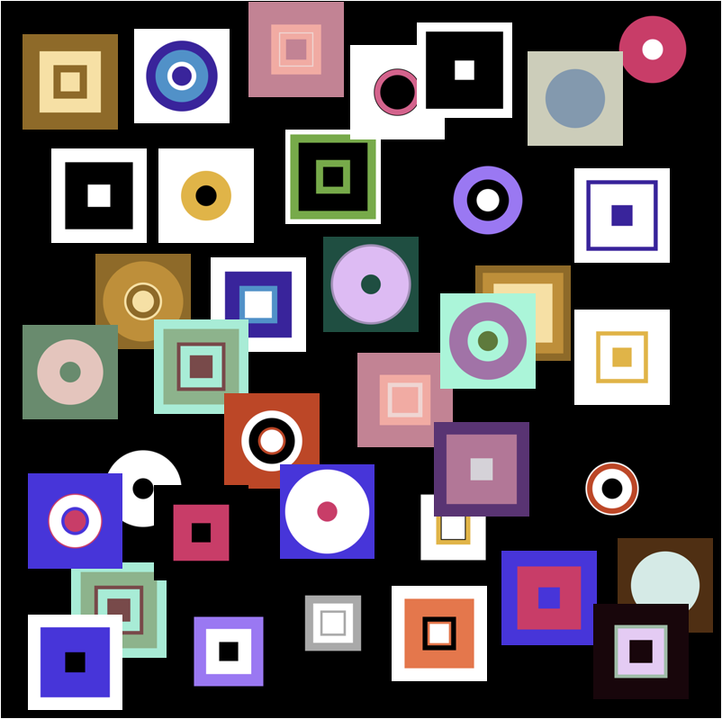

 

An Apple Developer tool to generate app icons and images for iPhone, iPad, Mac, Apple TV, Apple Watch and Car Play.

**Description:** \
Provide a 1024x1024 pixel image to generate the required Apple app icon sets for the various device types. \
Provide a 3x pixel image to generate 1x, 2x, 3x image set i.e. provide a 300x300 pixel image for a 100x100 point image set. 

 

**Features:** 
- Generate asset catalogs, app icon sets, image sets and individual images
- Drag and drop source image or select from file directory
- Drag and drop resulting AppIcon.appiconset into Xcode project with one drag
- Use png, jpg, tiff or gif for source image
- Select desired source and destination directories
- Settings are automatically saved including directories
- Use slider to expand source image for better viewing
- Organize files by automatically placing results in a folder named after the image
- Use randomly-generated source image as a time saver, if desired (See examples below)

*Example using app to create images sets using a single image (shown in Dark mode)*

**Technical Info:** \
Mac application written in Swift 5 \
Requires Xcode 11 to initially generate app

**Installations:**
1. Open project in Xcode
2. Go to project settings for the target and update the your signing information(signing and capabilities)
3. Build and run the app in Xcode. 
4. Use Spotlight Search to locate MakeIconsSwiftly.app in the derived data folder
5. Drap MakeIconsSwiftly.app to the desktop or applications folder for use as desired. 

*Optional: Example using a randomly-generated image to quickly create an icon set*

**Author:** \
Marcy Vernon [@MarcyVernon](https://twitter.com/MarcyVernon)

**License:** \
"Make Icons Swiftly" is under the MIT license. See [LICENSE](/LICENSE) for more information.

*Examples of optional source images randomly created with App*

